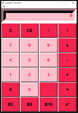
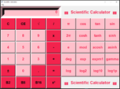

#    Scientific Calculator - Fanny THIBERT

Project : Create a scientific calculator in python3
 and create an executable file
 
 Calculator with standard or scientific screen :
 
                         
  
  
  
  
  
 
 
 
 

with possibility of result conversion into binary, octal and hexadecimal

 --- Tkinter ---
         
         Tkinter is a Python library for dealing with graphism.

         Installation
              >> pip install tk
            Usage :
              from tkinter import *

         Alert message confirmation :
            usage :
              import tkinter.messagebox

 --- Math ---
 
        Math on python : perform simple and more complex calculations
            Usage:
              import math

 --- Launch --- 
 
        In windows cmd > python3 calculator.py
        Or execute program calculator.exe

Coding Academy by Epitech - Fanny THIBERT - 2022
